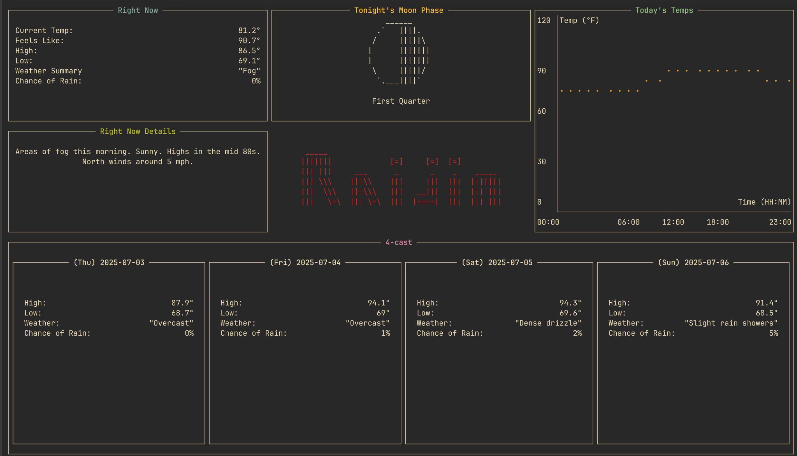

  <h1>Raijin</h1>

  

 

## Why?

This is an adaption of Raijin (href="https://github.com/MasonStooksbury/Raijin").
Usable for Non-US-Americans and a tad more info.

## Why "Fujin"?
It's the other Japanese weather God next to Raijin.
